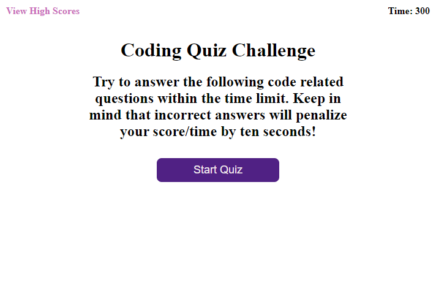

# Code Quiz

A website that quizzes the user on certain programming concepts, records their score, and displays it on a high score sheet. You can visit the page [here](https://robertareedy.github.io/code-quiz/).

